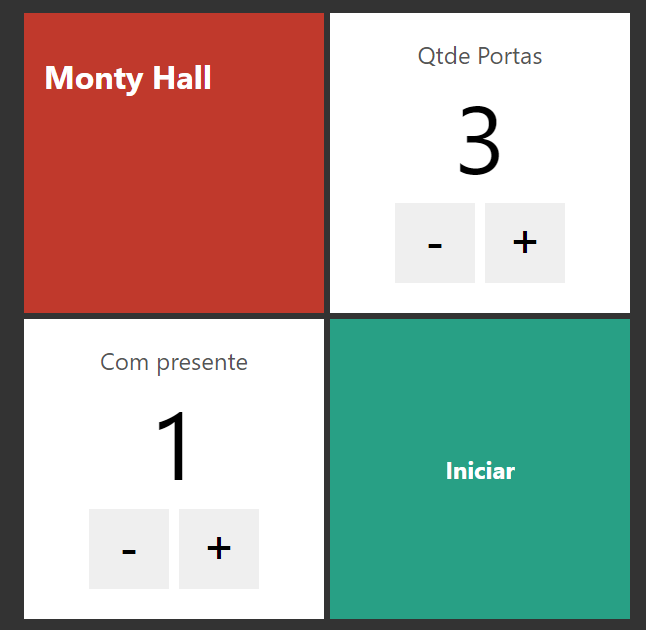

   
  
  
  

  

    <strong>Paradoxo de Month Hall - Projeto do curso Next.js e React</strong>
  

  

    <a href="https://montyhall-rho.vercel.app/" target="_blank" rel="noopener">Ver projeto em execução</a>
  

## Motivo
Projeto desenvido em Nextjs no curso de Nextjs e ReactJs da Cod3r.

O deploy foi deito em Vercel e pode ser conferido [aqui](https://montyhall-rho.vercel.app/).

